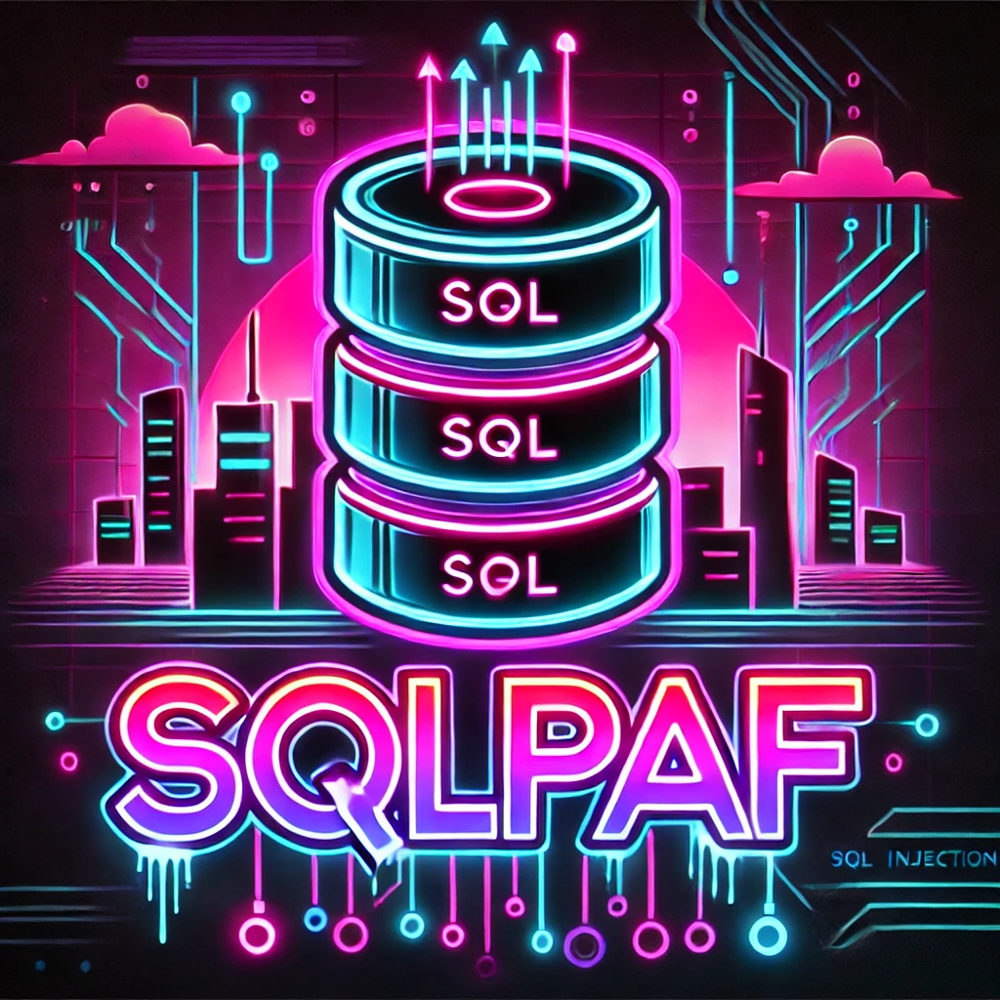

# 🚀 SQLPaf


[](https://www.linkedin.com/in/leo-dardillac/)
[](https://www.linkedin.com/in/adrien-moncet/)



SQLPaf is a powerful penetration testing framework designed to automate the detection and exploitation of SQL injection vulnerabilities.
It combines Gobuster's brute-force web directory scanning and an AI-powered form recognition engine proven payload injection capabilities. The result is a streamlined and efficient process for identifying, analyzing, and exploiting vulnerable web applications at scale.

## ⚠️ Disclaimer

SQLPaf is designed exclusively for ethical penetration testing and security research with explicit authorization from the target owner.
Any unauthorized use of this tool against systems where you do not have permission is strictly prohibited.
The developers take no responsibility for illegal use or any damages resulting from improper application.

## 📦 Requirements

- Python 3.10+
- Docker
- Gobuster
- gym
- selenium
- Pillow
- torch
- numpy

## ⚙️ Installation

Depending on your setup and how you prefer to run SQLPaf, there are two main installation methods available:

- Dockerized environment for a fast, isolated, and portable setup
- Local installation for direct execution on your machine

Both methods are simple to deploy. Below you'll find the detailed steps for each approach.

### 🛠️ Methods

<details>
 <summary>🐳 On Docker (Recommendend):</summary>
 ㅤ
 
This method isolates SQLPaf and dependencies in a container, making deployment consistent across environments.

Clone the repository:

```bash
git clone https://github.com/Vault-of-Jok3r/SQLPaf.git
cd SQLPaf
```

Build and launch the Docker:

```bash
docker build -t sqlpaf .
docker run -it --hostname pafologue --name SQLPaf sqlpaf
```

Install python dependencies:

```bash
pip3 install -r requirements.txt
```

Run the code:

```bash
./SQLPaf.sh
```
</details>
<details>
 <summary>💻 On your machine:</summary>
 ㅤ
 
 If you are not familiar with Docker, you can still install it on your main machine.

Clone the repository:

```bash
git clone https://github.com/Vault-of-Jok3r/SQLPaf.git
cd SQLPaf
```

Install python dependencies:

```bash
pip install -r requirements.txt
```

Give the code the authorisation of execution and run it:

```bash
chmod +x SQLPaf.sh
./SQLPaf.sh
```
</details>

## 🎯 How to use :

add

## 👨‍💻 Authors :
 
- Vault-of-Jok3r - Léo Dardillac
- Zap2204 - Adrien Moncet

## 🌐 Official repositories

- [Gobuster](https://github.com/OJ/gobuster)
